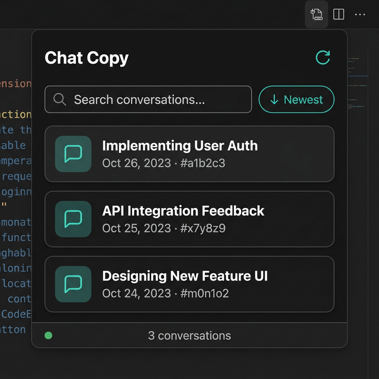
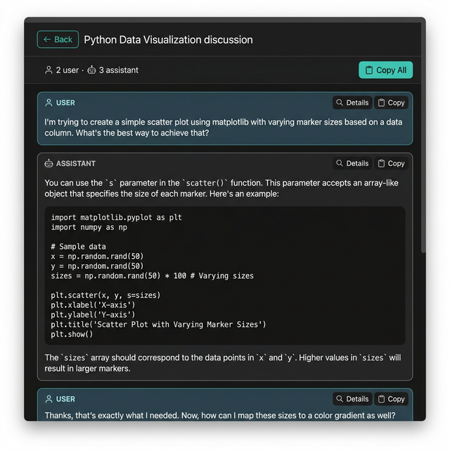
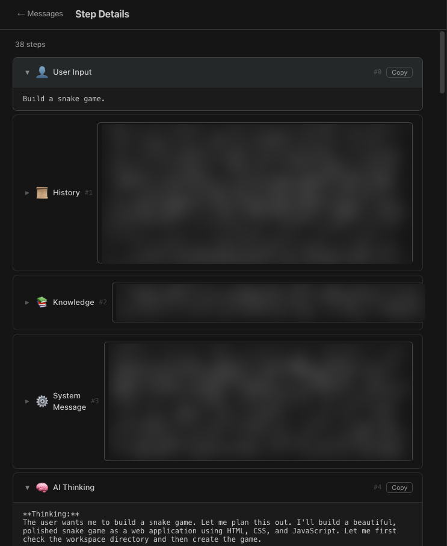

<p align="center">
  
  
</p>

<h1 align="center">Antigravity Chat Copy</h1>

<p align="center">
  <b>Copy original markdown from Antigravity AI chat conversations.</b><br>
  Browse, search, inspect every step, and copy — all from a single tab.
</p>

<p align="center">
  
  
  
  
</p>

---

## Why?

Antigravity renders chat responses in a closed webview — you can't select or copy the original markdown. This extension connects directly to the local Language Server via ConnectRPC **and** decrypts the on-disk `.pb` trajectory files, giving you the raw content with one click.

## Features

| Feature | Description |
|---------|-------------|
| 📋 **Copy** | Copy any message's original markdown to clipboard |
| 📋 **Copy All** | Copy the entire conversation in one click |
| 🔍 **Step Details** | Inspect every internal step (thinking, tool calls, code actions, commands, searches) between a user input and the assistant reply |
| 🔎 **Search & Sort** | Filter conversations by title, sort by newest/oldest |
| 🏢 **Workspace Filter** | Only shows conversations from the current workspace |
| ⟳ **Reload** | Refresh conversation list or re-fetch current chat; auto-reconnects if LS restarted |
| ⌨️ **Keyboard Nav** | `Esc` to go back, `Enter` to select, full focus-visible support |
| 💾 **Disk + API** | Loads from encrypted `.pb` files (instant) and API in parallel, picks the source with more steps |
| 🔐 **Auto Key Extraction** | Extracts AES-256-GCM key from the LS binary (ELF `.rodata` scan + process memory fallback) |

<p align="center">
  
</p>

## Installation

### From Release (recommended)

1. Download the latest `.vsix` file from the [Releases](https://github.com/Zachary-Lee-Jaeho/Antigravity-Chat-Copy/releases) page
2. Install in Antigravity:
   `Ctrl+Shift+P` → **"Extensions: Install from VSIX…"** → select the file

### From Source

```bash
git clone https://github.com/Zachary-Lee-Jaeho/Antigravity-Chat-Copy.git
cd antigravity-chat-copy
npm install
npm run compile
ln -s $(pwd) ~/.vscode/extensions/antigravity-chat-copy
```

## Usage

1. Open any project in Antigravity
2. Press `Ctrl+Shift+M` — or run **"Open Chat Copy"** from the command palette
3. Browse conversations → click to view → copy what you need
4. Hit ⟳ to reload the conversation list or re-fetch current chat messages

## How It Works

```
┌───────────────────────────────────────────────────────────────┐
│  Antigravity (Electron)                                       │
│  ┌──────────────┐                                             │
│  │ Language      │ ◄── HTTPS + CSRF + ConnectRPC ─┤── Extension│
│  │ Server (LS)  │     GetCascadeTrajectorySteps   │           │
│  └──────┬───────┘                                             │
│         │ writes encrypted .pb files                          │
│         ▼                                                     │
│  ~/.gemini/antigravity/conversations/*.pb                     │
│         │                                                     │
│         ▼                                                     │
│  ┌──────────────────────┐                                     │
│  │ Extension reads .pb  │                                     │
│  │ 1. Extract AES key   │ ◄─ ELF .rodata scan (Tier 1)       │
│  │    from LS binary    │ ◄─ /proc/PID/mem scan (Tier 2)     │
│  │ 2. AES-256-GCM       │                                     │
│  │    decrypt            │                                     │
│  │ 3. Protobuf wire     │                                     │
│  │    decode (schema-   │                                     │
│  │    free)             │                                     │
│  └──────────────────────┘                                     │
│                                                               │
│  /proc discovery (for API path):                              │
│   1. /proc/*/cmdline → find LS PID + CSRF token              │
│   2. /proc/PID/fd   → socket inodes                          │
│   3. /proc/net/tcp  → listening ports                         │
│   4. Heartbeat RPC  → verify correct port                    │
│   5. cert.pem       → TLS certificate pinning                │
└───────────────────────────────────────────────────────────────┘
```

### Dual-Source Loading

When loading a conversation, the extension fetches data from **both** sources in parallel:
- **Disk**: Decrypt `.pb` → protobuf wire decode → typed `Step[]` (instant, no step limit)
- **API**: `GetCascadeTrajectorySteps` + `GetCascadeTrajectory` (capped at ~976 steps)

The source with **more steps** wins. This means disk-based loading bypasses the API's step limit, while the API serves as a fallback when the key extraction fails.

### Key Extraction (Two-Tier)

1. **Tier 1 — ELF Binary Scan**: Parse the LS binary's `.rodata` section for 32-byte all-alpha candidates, validate each by trial-decrypting the smallest `.pb` file.
2. **Tier 2 — Process Memory Scan**: If Tier 1 fails, scan the running LS process memory (`/proc/PID/mem`) for key candidates using the same trial-decryption validation.

### Message Extraction

The extension handles two types of assistant responses:
- **`NOTIFY_USER` steps** — primary assistant replies (via `notify_user` tool)
- **`PLANNER_RESPONSE` steps** — direct assistant replies (via `modifiedResponse` field), used when the assistant responds without calling `notify_user`

This two-pass extraction ensures **no messages are missed**, even for active conversations.

## Architecture

```
src/
├── extension.ts          # Entry point, panel lifecycle, dual-source loading (183 lines)
├── webview.ts            # Single-page app UI: HTML/CSS/JS (218 lines)
├── lsClient.ts           # LS discovery via /proc & ConnectRPC calls (153 lines)
├── markdownExtractor.ts  # Two-pass message extraction & step parsing (216 lines)
├── proto.ts              # Protobuf wire-format decoder & trajectory parser (433 lines)
├── crypto.ts             # AES-256-GCM key extraction & decryption (248 lines)
└── types.ts              # Shared TypeScript interfaces & constants (158 lines)
```

**1,609 lines total.** No frameworks. No runtime dependencies beyond the VS Code API.

## API Details

| API | Purpose | Response |
|-----|---------|----------|
| `GetCascadeTrajectory` | Conversation list metadata (workspace URI, title prefetch) | `{ trajectory: { steps, metadata } }` |
| `GetCascadeTrajectorySteps` | **Real-time** full trajectory for viewing | `{ steps: [...] }` |
| `Heartbeat` | Port verification during discovery | `{}` |

## Step Types

When you click **🔍 Details** on an assistant message, you see every internal step:

| Icon | Step Type | Default |
|:----:|-----------|:-------:|
| 👤 | User Input | Open |
| 💬 | Assistant Reply | Open |
| ✏️ | Code Action | Open |
| ✅ | Code Applied | Closed |
| ❌ | Error | Open |
| 🧠 | AI Thinking | Closed |
| ⚡ | Run Command | Closed |
| 📊 | Command Output | Closed |
| 📁 | List Directory | Closed |
| 📄 | View File | Closed |
| 📋 | File Outline | Closed |
| 🔬 | View Code | Closed |
| 📑 | View Content | Closed |
| 🔍 | Grep Search | Closed |
| 🔎 | Find Files | Closed |
| 🌐 | Web Search | Closed |
| 🔗 | Read URL | Closed |
| 🖥️ | Browser | Closed |
| 🎨 | Generate Image | Closed |
| 📌 | Task Update | Closed |
| ⚙️ | System Message | Closed |
| 📜 | History | Closed |
| 📚 | Knowledge | Closed |
| 🔖 | Checkpoint | Closed |

## Configuration

| Setting | Default | Description |
|---------|:-------:|-------------|
| `antigravityChatCopy.allowInsecureTls` | `false` | Allow insecure TLS when `cert.pem` pinning fails |

## Security

- **No hardcoded secrets.** AES keys and CSRF tokens are discovered at runtime from local processes and binaries.
- **Loopback only.** All connections go to `127.0.0.1`.
- **TLS pinned.** Uses Antigravity's own `cert.pem` for certificate verification.
- **No network calls.** Zero external requests — everything stays local.
- **Read-only.** No data is modified — only conversation content is read and displayed.

## Limitations

- **Linux only** (V1). macOS/Windows support requires platform-specific `/proc` alternatives.
- **Conversation titles** are derived from the first user message. AI-generated titles require the streaming API (`StreamCascadeSummariesReactiveUpdates`).
- **Key extraction** may fail if the LS binary format changes. The extension will show a warning and fall back to API-only mode.

## ⚠️ Disclaimer

This project is **unofficial** and **not affiliated with, endorsed by, or supported by Google, Antigravity, Codeium, or Exafunction.**

- This extension accesses the **local Antigravity Language Server** via **non-public internal APIs** (`GetCascadeTrajectorySteps`, `Heartbeat`). These APIs are undocumented and may change or break at any time.
- CSRF tokens are read from local process information (`/proc`), which may be considered an **access control bypass** under certain Terms of Service.
- AES-256-GCM encryption keys are extracted from the **Language Server binary and process memory** to decrypt locally-stored `.pb` conversation files. This constitutes **reverse engineering** of the encryption mechanism.
- Using this extension **may violate** the [Antigravity Terms of Service](https://antigravity.google/docs/faq) (Section 6: third-party tool access) or the [Windsurf/Codeium Terms of Service](https://windsurf.com/terms-of-service-individual) (Section 13.4: non-official software access).
- **Use at your own risk.** The authors are not responsible for any account restrictions, suspensions, or other consequences resulting from the use of this software.
- All data access is **read-only** and **strictly local** (`127.0.0.1`). No external network requests are made.

## License

MIT

---

<p align="center">
  Built with ❤️ for Antigravity users who just want to copy their chat.
</p>
